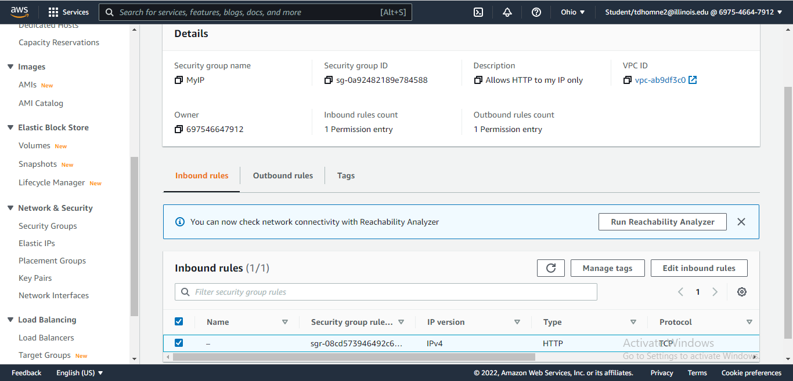

# EC2 Instance

a.  Screenshot of your security group "Inbound" rule. 



```{r}
1 + 2
```

b.  Screenshot of your EC2 instance "Details" tab.


c.  Screenshot of your RStudio server.


# List of all files in your `lab-01` folder

Create an itemized list of all final files in your `lab-01` folder.

Final Files in 'lab-01' folder:
1. lab-01.Rmd
2. screenshot.jpg
3. instance.jpg
4. rstudio.jpg